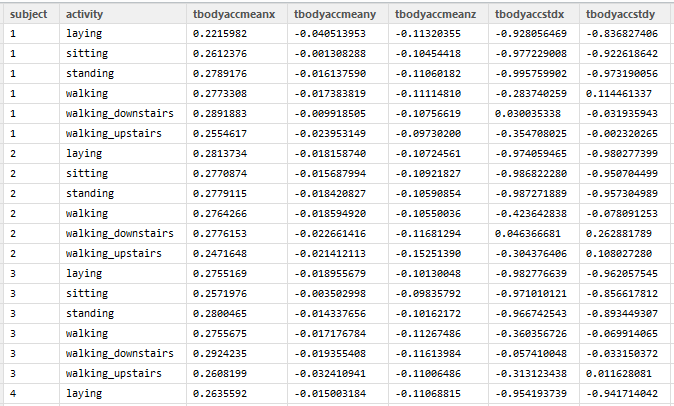

#CodeBook for TidyData Course Project  #

This project uses the data from experiments by
==================================================================
Jorge L. Reyes-Ortiz, Davide Anguita, Alessandro Ghio, Luca Oneto.
Smartlab - Non Linear Complex Systems Laboratory
DITEN - Università degli Studi di Genova.
Via Opera Pia 11A, I-16145, Genoa, Italy.
activityrecognition@smartlab.ws

==================================================================

### NOTE: Structure of this CodeBook.md is based on the template created by Klaas Joris Schut (https://class.coursera.org/getdata-012/forum/profile?user_id=5765263)

###Project Description

####Human Activity Recognition Using Smartphones Dataset Version 1.0

The "Human Activity Recognition Using Smartphones Dataset Version 1.0" was the results of experiments carried out with a group of 30 volunteers within an age bracket of 19-48 years. Each person performed six activities (WALKING, WALKING_UPSTAIRS, WALKING_DOWNSTAIRS, SITTING, STANDING, LAYING) wearing a smartphone (Samsung Galaxy S II) on the waist. Using its embedded accelerometer and gyroscope, we captured 3-axial linear acceleration and 3-axial angular velocity at a constant rate of 50Hz. The experiments have been video-recorded to label the data manually. The obtained dataset has been randomly partitioned into two sets, where 70% of the volunteers was selected for generating the training data and 30% the test data.

The sensor signals (accelerometer and gyroscope) were pre-processed by applying noise filters and then sampled in fixed-width sliding windows of 2.56 sec and 50% overlap (128 readings/window). The sensor acceleration signal, which has gravitational and body motion components, was separated using a Butterworth low-pass filter into body acceleration and gravity. The gravitational force is assumed to have only low frequency components, therefore a filter with 0.3 Hz cutoff frequency was used. From each window, a vector of features was obtained by calculating variables from the time and frequency domain. See 'features_info.txt' for more details. 

Further details and descriptions of the experiments and raw data can be found in the original source located here:

		http://archive.ics.uci.edu/ml/datasets/Human+Activity+Recognition+Using+Smartphones

Here are the data for the project: 

		https://d396qusza40orc.cloudfront.net/getdata%2Fprojectfiles%2FUCI%20HAR%20Dataset.zip 

####Notes on the final tidy data set.

This project uses the above dataset to create an independent Tidy Dataset (file  "Step5TidyData.txt") using the run_analysis.R script.  Below is a sample view:

Dimensions of the dataset :  180 objects , 68 variables

####Summary of the data

     Column Description
        1   "subject"
			Type:  integer
			Range:   1 - 30
			This refers to the 30 volunteers.

        2:  "activity"
			Type:  chr
			Range: "laying" "sitting" "standing" "walking" "walking_downstairs" "walking_upstairs"

####Column 3-68 are data collected (or derived) from the accelerometer and gyroscope of the phone.  

            Column 3-42 are ALL numeric
            Starting with "t..." , these are all time domain signals.
            Please refer to features_info.txt for more information with respect to these parameters.

		3	"tbodyaccmeanx"    
        4   "tbodyaccmeany"
        5   "tbodyaccmeanz"          
		6	"tbodyaccstdx"
        7   "tbodyaccstdy" 
        8   "tbodyaccstdz" 
        9   "tgravityaccmeanx"
       10   "tgravityaccmeany" 
	   11   "tgravityaccmeanz" 
       12   "tgravityaccstdx" 
       13   "tgravityaccstdy"
       14   "tgravityaccstdz"
       15   "tbodyaccjerkmeanx"       
	   16   "tbodyaccjerkmeany"
       17   "tbodyaccjerkmeanz" 
       18   "tbodyaccjerkstdx"
       19   "tbodyaccjerkstdy" 
       20   "tbodyaccjerkstdz" 
	   21   "tbodygyromeanx"
       22   "tbodygyromeany"
       23   "tbodygyromeanz"
       24   "tbodygyrostdx"
       25   "tbodygyrostdy"           
	   26   "tbodygyrostdz"
       27   "tbodygyrojerkmeanx" 
       28   "tbodygyrojerkmeany"
       29   "tbodygyrojerkmeanz" 
       30   "tbodygyrojerkstdx"       
	   31   "tbodygyrojerkstdy"  
       32   "tbodygyrojerkstdz"  
       33   "tbodyaccmagmean"   
       34   "tbodyaccmagstd"   
       35   "tgravityaccmagmean"      
       36   "tgravityaccmagstd"  
       37   "tbodyaccjerkmagmean" 
       38   "tbodyaccjerkmagstd" 
       39   "tbodygyromagmean"  
       40   "tbodygyromagstd"         
       41   "tbodygyrojerkmagmean"  
       42   "tbodygyrojerkmagstd"

####Column 43 - 68 are ALL numeric
            Starting with "f..." , these are FFT of the "t..." series above.
            Note that not all of the "t..." series above are transformed.)
            Please refer to features_info.txt for more information with respect to these parameters.

	   43  "fbodyaccmeanx"
       44  "fbodyaccmeany"
       45  "fbodyaccmeanz"           
       46  "fbodyaccstdx"
       47  "fbodyaccstdy"
       48  "fbodyaccstdz"
       49  "fbodyaccjerkmeanx"
       50  "fbodyaccjerkmeany"       
       51  "fbodyaccjerkmeanz"
       52  "fbodyaccjerkstdx"
       53  "fbodyaccjerkstdy"
       54  "fbodyaccjerkstdz"
       55  "fbodygyromeanx"          
       56  "fbodygyromeany"
       57  "fbodygyromeanz" 
       58  "fbodygyrostdx"
       59  "fbodygyrostdy" 
       60  "fbodygyrostdz"           
       61  "fbodyaccmagmean"   
       62  "fbodyaccmagstd"  
       63  "fbodybodyaccjerkmagmean"
       64  "fbodybodyaccjerkmagstd" 
       65  "fbodybodygyromagmean"    
       66  "fbodybodygyromagstd"  
       67  "fbodybodygyrojerkmagmean" 
       68  "fbodybodygyrojerkmagstd" 

